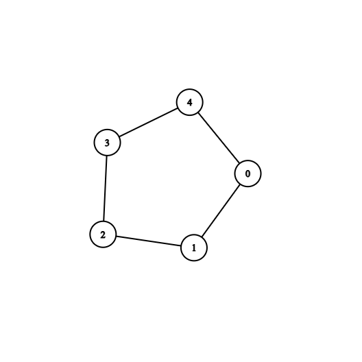
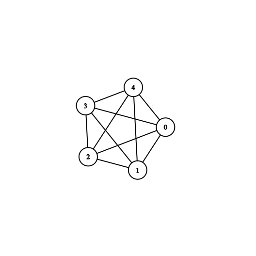
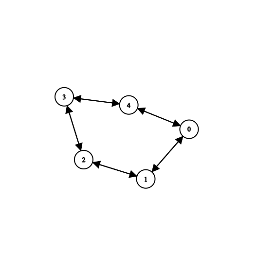
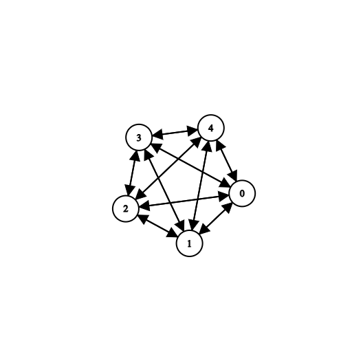

## P1
### Use adjacency matrix, adjacency list and incidence matrix for representing the graph. Also evaluate their memory usage and efficiency for basic operations like adding and removing edges.

> Undirected_Sparse
> 
---
> Undirected_Dense
> 
---
> Directed_Sparse
> 
---
> Directed_Dense
> 